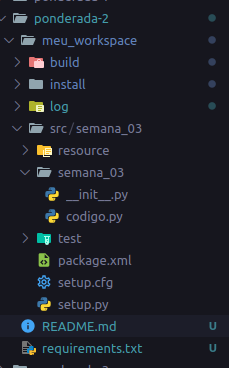

# Turtlebot Teleoperado

## Objetivo
Fazer o setup e interagir com o turtlebot, compreendendo os conceitos básico para uso do ROS em rede e dos pacotes para interação com o robô.

## Atividade Desenvolvida

### Workspace
Na figura abaixo é possível visualizar o workspace seguindo os padrões ROS2. 



### CLI
O código implementa uma CLI para operar o nó de controle de robô  através da linha de comando. Ele permite controlar o robô usando as teclas W, S, A, D para movimento e Q para sair. 

### Tópicos
O código utiliza ROS 2 para publicar comandos de velocidade (Twist) no tópico 'cmd_vel', controlando assim o movimento do robô.
```
        # Criar um publisher
        self.velocity_pub = self.create_publisher(Twist, 'cmd_vel', 10)

        # Publica a velocidade linear e angular
        msg = Twist()
        msg.linear.x = self.linear_speed
        msg.angular.z = self.angular_speed
        self.velocity_pub.publish(msg)
```
### Serviços

O código implementa dois serviços, `stop_robot_service`, para parar o robô imediatamente, e `shutdown_robot_service`, para desligar o nó do controle do robô.

```
    def stop_robot_service(self, response):
        self.stop_robot()
        return response

    def shutdown_robot_service(self, response):
        self.shutdown_robot()
        return response
```

### Parada de emergência: 
O sistema de emergência foi feito com uma estrutura de serviços. Assim, quando o usuário decide apertar a tecla Q é ativado a função de parada e cessa toda comunicação com o nó do webots.

```
    def stop_robot(self):
        self.key_pressed = None
        self.linear_speed = 0.0
        self.angular_speed = 0.0
        self.get_logger().info("Emergency stop activated!")
```

### Controle do Robô
As teclas 'W', 'A', 'S', 'D' controlam a velocidade linear e angular do robô para frente, trás, esquerda e direita, respectivamente. A tecla 'Q' ativa a parada de emergência e desliga o nó.

```
        def timer_callback(self):
        if not self.running:
            self.destroy_node()
            return

        # Atualiza as velocidades com base na tecla pressionada
        if self.key_pressed:
            if self.key_pressed == 'w':
                self.linear_speed = 2.0
            elif self.key_pressed == 's':
                self.linear_speed = -2.0
            elif self.key_pressed == 'a':
                self.angular_speed = 2.0
            elif self.key_pressed == 'd':
                self.angular_speed = -2.0
        else:
            # Se nenhum botão estiver pressionado, pare o robô
            self.linear_speed = 0.0
            self.angular_speed = 0.0

        # Imprime as velocidades atuais
        sys.stdout.write(f"\rVelocidade linear: {self.linear_speed}, Velocidade angular: {self.angular_speed}")
        sys.stdout.flush()

        # Publica a velocidade linear e angular
        msg = Twist()
        msg.linear.x = self.linear_speed
        msg.angular.z = self.angular_speed
        self.velocity_pub.publish(msg)
```

### Telemetria
O nó publica as velocidades linear e angular no tópico 'cmd_vel', permitindo que outros nós ou sistemas leiam e controlem um robô físico ou simulado.

```
def main(args=None):
    rclpy.init(args=args)
    node = RobotControlNode()
    try:
        rclpy.spin(node)
    except KeyboardInterrupt:
        pass
    node.destroy_node()
    rclpy.shutdown()

if __name__ == '__main__':
    main()
```


## Utilização da Solução

Para executar a aplicação, é necessário seguir os seguintes passos:

1. Em um terminal, acessar a raíz do workspace.

```
cd ponderada-2/meu_workspace/src
```

2. Agora, é necessário construir o pacote. Para isso, deve-se executar o seguinte comando:

```
colcon build
```

3. Com o pacote criado, basta executar:

```
source install/setup.bash
```

4. Em sequência, é necessário executar o pacote:

```
ros2 run semana_03 semana_03 
```

5. Num segundo terminal, o usuário deve rodar o webots, para que seja possível simular a movimentação do turtlebot3. Para isso, deve-se executar o comando:

```
ros2 launch webots_ros2_turtlebot robot_launch.py
```

## Vídeo
O vídeo abaixo serve de demonstração da utilização da solução.

[![V[ideo de demonstração da solução]](https://img.youtube.com/vi/QI8BTZm1nMc/0.jpg)](https://youtu.be/QI8BTZm1nMc)